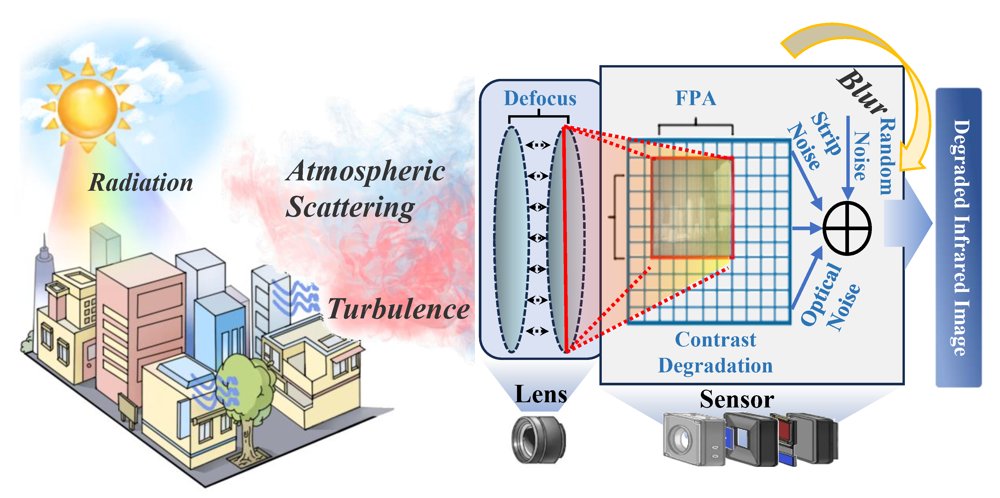
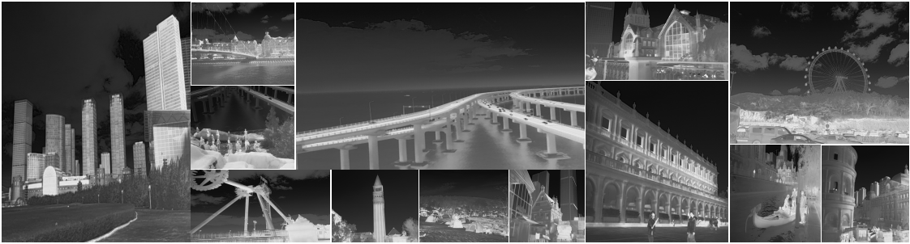

<h2> Enhancing Infrared Vision: Progressive Prompt Fusion Network and Benchmark</h2>
Jinyuan Liu, Zihang Chen, Zhu Liu, Zhiying Jiang, Long Ma, Xin Fan, Risheng Liu

###  Enhancing Infrared Vision: Progressive Prompt Fusion Network and Benchmark [NeurIPS 2025]

---



---
### Updates
[2025-10-13] The arXiv version of the paper is available [here](https://arxiv.org/abs/2510.09343).

[2025-10-7] The code and dataset are available.

[2025-9-30] Our paper has been accepted by NeurIPS 2025, and the code will be released soon.

## HM-TIR Dataset
The preview of our dataset is as follows.

---


 
---

### Download
The datasets containing clean and degraded infrared images are provided in:
- [Google Drive](https://drive.google.com/file/d/17kq2NQ-8bFeESlanffcOSlFLwGb0Y8Rq/view?usp=sharing)

## Progressive Prompt Fusion Network (PPFN) For Infrared Enhancement

---


---

### Quick Start

For quick start, first, you can create a new environment:

```
conda create -n PPFN python=3.8
conda activate PPFN
pip install -r requirements.txt
```

Then download the pretrained model [weights](https://drive.google.com/file/d/1Yt_YViFCpxgO-MfBlINVt4-jHAgsalv_/view?usp=sharing).

You can run the following command:

```
CUDA_VISIBLE_DEVICES=0 python demo.py --dataset_dir ./example/{normal, hard} --output example/enhanced --weights put/weight/path/here
```

### Data Preparation

You should put the dataset in the "datasets" fold in the following form.

```
TarDAL ROOT
├── datasets
|   ├── HM-TIR
|   |   ├── imgs # all clean infrared images
|   |   ├── composited # test composited degraded infrared images
|   |   |   ├── normal # sub test set in normal degradation
|   |   |   └── hard # sub test set in hard degradation
|   |   ├── single # single degraded infrared images
|   |   |   ├── blur # sub test set in blur degradation
|   |   |   ├── contrast # sub test set in contrast degradation
|   |   |   └── noise # sub test set in noise degradation
|   |   ├── test # test clean infrared images
|   |   └── meta # meta data, includes: train.txt, test.txt
|   └── ...
```

### Training
Download the HM-TIR dataset, then run the command:
```
python train.py --dataset_name HM-TIR --dataset_dir datasets 
```

### Testing
For composited degradation scenario, run the following command:
```
python evluation.py --dataset_name HM-TIR --dataset_dir datasets --deg_scenario composited --subset {normal, hard} --output results --weights put/weight/path/here
```

For single degradation scenario, run the following command:
```
python evluation.py --dataset_name HM-TIR --dataset_dir datasets --deg_scenario single --subset {contrast, blur, noise}  --output results --weights put/weight/path/here
```

For real-world dataset evaluation, we select 70 images form Iray. You can download the [images](https://drive.google.com/file/d/1uhWCvPExarnUL-r_G0MW530RXKpj5izJ/view?usp=sharing) we selected, then run the following command:
```
python inference.py --dataset_name Iray_select --dataset_dir datasets --output results --cal_iqa True --weights put/weight/path/here
```

You can download some results in [here](https://drive.google.com/file/d/10jiNGF0c6H0cR83yEN5I3stLf9qiX6cR/view?usp=sharing)


### Generating new degraded TIR Images
If you want to generate new degraded TIR Images with new degradation levels or types, first, changing the "create_corrupt.py" file about degradation setting (lines 18-68), then, run the following command:
```
python create_corrupt.py --dataset_name HM-TIR --dataset_dir datasets --save_dir datasets/corrputed
```

### Any Question

If you have any other questions about the code and dataset, please email to [Zihang Chen](mailto:chenzi_hang@mail.dlut.edu.cn) or [Jinyuan Liu](mailto:atlantis918@hotmail.com).


## Acknowledgement
Our core codes are based on [MIOIR](https://github.com/Xiangtaokong/MiOIR) and [LLFormer](https://github.com/TaoWangzj/LLFormer), thanks for their contribution.


