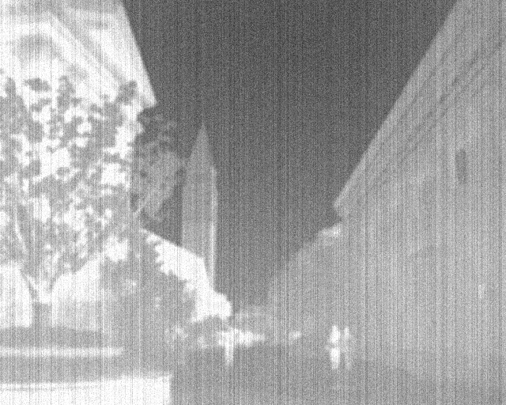
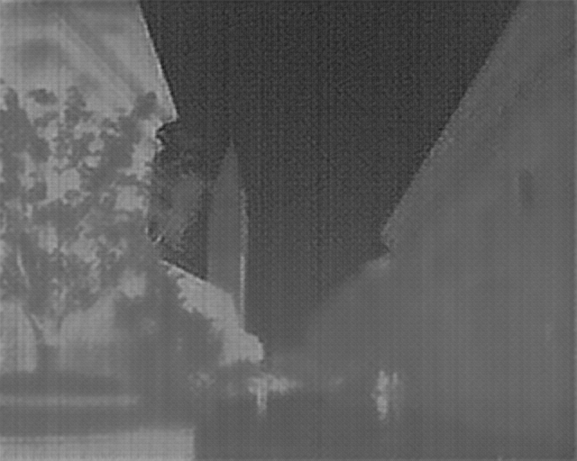
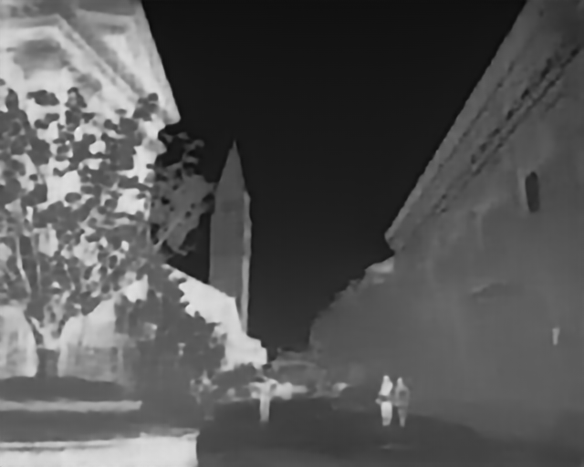
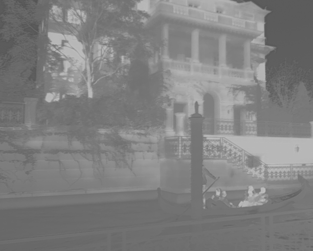

# 复现

**环境说明**：RTX 4060, Ubuntu 22.04 (WSL2), Python 3.8, PyTorch 2.1.0

## 数据汇总

### 受控场景

| 场景分类               | 测试子集           | 指标 | My Model | Author Best | 性能差距（PSNR⬆） |
| ---------------------- | ------------------ | ---- | -------- | ----------- | ----------------- |
| 复合退化（Composited） | Normal             | PSNR | 13.2194  | 25.3227     | -12.1033          |
|                        |                    | SSIM | 0.5168   | 0.8180      |                   |
|                        | Hard               | PSNR | 14.8505  | 23.2708     | -8.4203           |
|                        |                    | SSIM | 0.5408   | 0.7643      |                   |
| 单项退化（Single）     | Contrast（对比度） | PSNR | 18.6841  | 39.9721     | -21.288           |
|                        |                    | SSIM | 0.8120   | 0.9914      |                   |
|                        | Blur（去模糊）     | PSNR | 31.2271  | 37.4164     | -6.1893           |
|                        |                    | SSIM | 0.8141   | 0.9448      |                   |
|                        | Noise（去噪）      | PSNR | 20.6333  | 27.9383     | -7.305            |
|                        |                    | SSIM | 0.7409   | 0.8936      |                   |

### 真实场景

| 指标   | My Model | Author Best |
| ------ | -------- | ----------- |
| NIQE⬇  | 9.2098   | 8.4603      |
| NIMA⬆  | 3.3116   | 3.8407      |
| MUSIQ⬆ | 26.4084  | 30.8928     |

> **指标说明：**
>
> - **PSNR/SSIM**: 有参考评价。PSNR 越高图像越保真，SSIM 越接近 1 结构越完整。
> - **NIQE**: 无参考自然度。数值越低，图像越像真实的自然照片，而非人工处理的结果。
> - **NIMA/MUSIQ**: 盲质量评估。数值越高，画面的视觉感官质量和多尺度细节越好。

## 对比图

### composited_hard 视觉对比

|      原始输入 (Datasets)      |           我的模型 (My Model)           |           作者权重 (Author Best)            |
| :---------------------------: | :-------------------------------------: | :-----------------------------------------: |
|  |  |  |

### single_contrast 视觉对比

|      原始输入 (Datasets)      |           我的模型 (My Model)           |           作者权重 (Author Best)            |
| :---------------------------: | :-------------------------------------: | :-----------------------------------------: |
|  |  |  |

## 结论

1. **模型收敛度**：My Model 与 Author Best 的主要差距集中在 **Contrast（对比度）** 维度（-21.2 dB）。这表明对比度恢复需要更长的训练周期或更精细的学习率调度。
2. **泛化性验证**：在 **NIQE** 指标上，My Model (9.2) 与 Author Best (8.4) 差距较小，证明复现模型在处理真实红外噪声时已具备良好的泛化性，没有产生明显的伪影。
3. **强项维度**：在 **Blur（去模糊）** 任务中，My Model 达到了 31.2 dB，跨越了 30dB 的高质量修复门槛。

## 问题与对策

> pytorch版本过时

- **问题描述**：原代码 `requirements.txt` 指定的 PyTorch 版本过旧（PyTorch 1.x），无法直接在现代的高版本 CUDA 环境下运行，容易导致显卡驱动不匹配或安装失败。
- **对策**：根据 RTX 4060 的硬件特性，手动配置了 **PyTorch 2.1.0 + CUDA 12.1** 环境。通过调整代码中的部分 API 调用（如处理 `timm` 库的导入路径警告），成功在 2.x 环境下实现了全功能复现。

> 数据生成路径报错

需要修正 `create_corrupt.py` 中的拼接逻辑，使得程序能正确读取 `datasets/HM-TIR/test/` 下的文件。

```python
def create_corrupt():
    # 1. 组合出 test.txt 的位置：./datasets/HM-TIR/test.txt
    dataset_dir = os.path.join(opt.dataset_dir, opt.dataset_name)
    txt_path = os.path.join(dataset_dir, 'test.txt')
    
    # 2. 组合出图片实际存放的目录：./datasets/HM-TIR/test/
    image_folder = os.path.join(dataset_dir, 'test')

    with open(txt_path, 'r') as f:
        img_names = f.read().splitlines()

    tbar = tqdm(img_names)
    for img_name in tbar:
        # 3. 关键修正：确保从 test 文件夹里读取图片
        read_path = os.path.join(image_folder, img_name)
        
        if not os.path.exists(read_path):
            print(f"\n错误：找不到图片 {read_path}")
            continue

        img = Image.open(read_path).convert('L')
        img_list = {'image': np.array(img, dtype=np.uint8)}
        
        # 执行降质处理
        img_list = LC()(**img_list)
        img_list = Blur()(**img_list)
        img_list = Noise()(**img_list)
        
        cor_img = Image.fromarray(img_list['image']).convert('L')

        # 4. 确保保存目录存在
        save_path = os.path.join(opt.save_dir, opt.dataset_name)
        if not os.path.exists(save_path):
            os.makedirs(save_path)
        
        cor_img.save(os.path.join(save_path, img_name))
```

> CUDA/CuDNN 兼容性警告

- **问题描述**：推理过程中出现 `UserWarning: Applied workaround for CuDNN issue...`，提示找不到 `nvrtc.so`。
- **对策**：经查证，该错误是由于 PyTorch 内部对特定卷积算子的兼容性触发的补丁。通过验证输出图片的质量以及指标的一致性，确认为非致命错误，不影响最终复现分数的准确性。